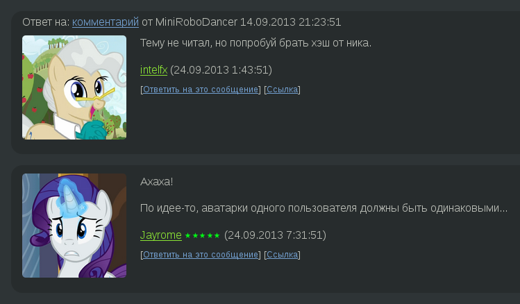
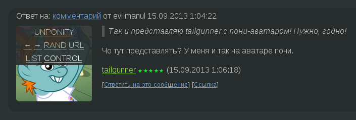
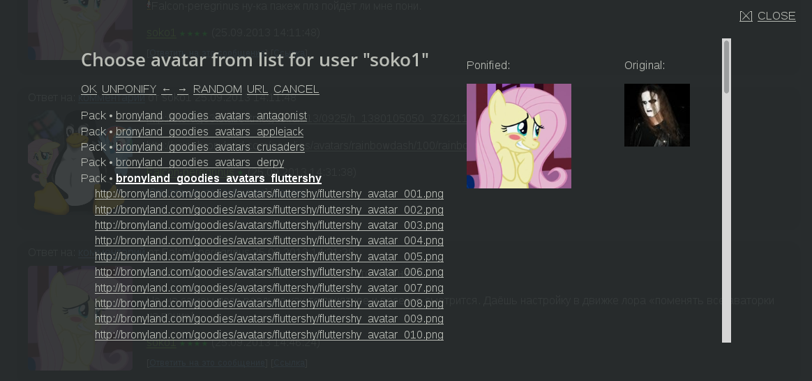
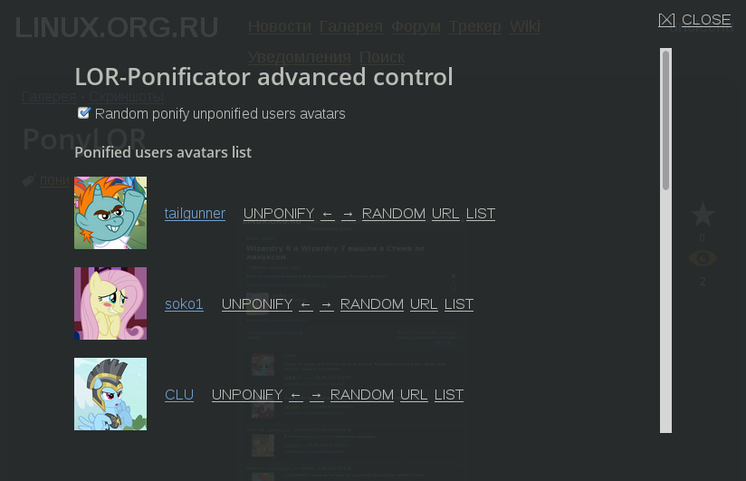

LOR-Ponificator
===============

LINUX.ORG.RU avatar ponificator. Greasemonkey script.

How to use
==========

1. Install [Greasemonkey](https://addons.mozilla.org/ru/firefox/addon/greasemonkey/ "Mozilla Addons page") to your Firefox;
2. Restart Firefox;
2. Open this link and click "install" in popup window: [LOR-Ponificator.user.js](https://github.com/unclechu/lor-ponificator/raw/master/LOR-Ponificator.user.js);
3. Refresh your LOR page(s);
4. Enjoy and ponify any user or anonymous avatar.

Overview
========

